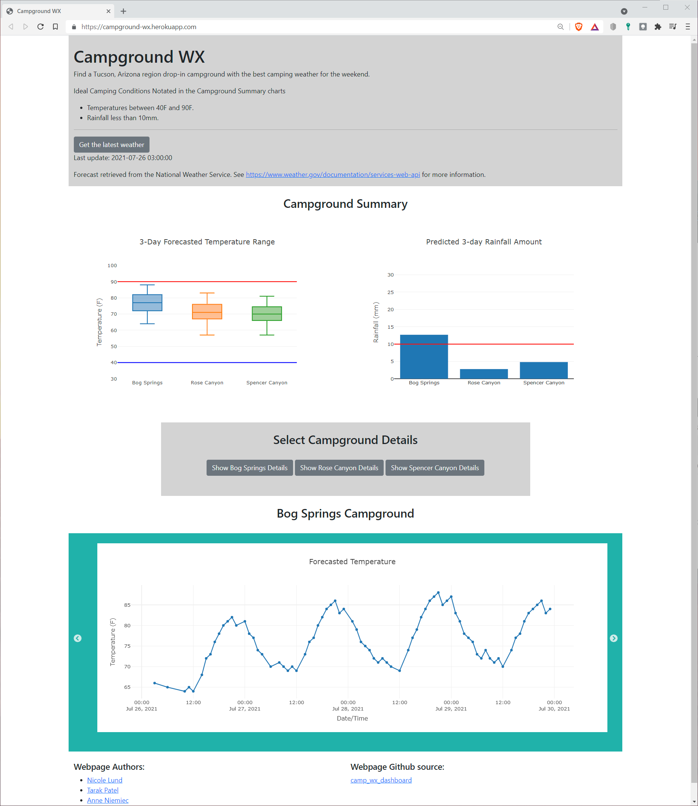
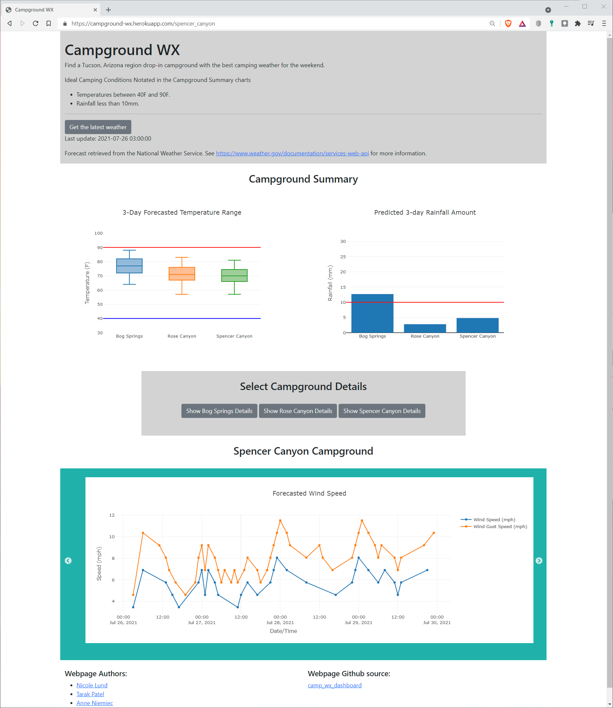

# camp_wx_dashboard
UofA Data Analytics Bootcamp Group Project 2, Visualization

**Team**:  
* Nicole Lund: <a href="https://www.linkedin.com/in/nicolelund-1/" target="_blank">https://www.linkedin.com/in/nicolelund-1/</a>
* Tarak Patel: <a href="https://www.linkedin.com/in/tarakpatel-1/" target="_blank">https://www.linkedin.com/in/tarakpatel-1/</a>
* Anne Niemiec: <a href="https://www.linkedin.com/in/anne-niemiec/" target="_blank">https://www.linkedin.com/in/anne-niemiec/</a>

### Description
Build a dashboard for a Tucson AZ camping club that gathers the National Weather Service forecast for their favorite campsites. Club members can quickly check the weather forecast to decide which campground to head to for the weekend.

### Deployed Website
<a href="https://campground-wx.herokuapp.com/" target="_blank">https://campground-wx.herokuapp.com/</a>

### Tools Utilized
| Webpage | Extract, Transform, Load (ETL) | Visualization |
|----------|----------|----------|
| Flask | Python | Javascript | 
| HTML | Pandas | D3.js |
| CSS | SQLAlchemy | Plotly.js |
| Heroku Server | postgreSQL | Slick.js |

### Project Content Descriptions
* **code_dev_archive**: Project proposal and initial layout, project instructions, Heroku server starter code, and development code
* **images**: Webpage screenshots
* **static**: webpage css and javascript files
* **templates**: webpage html
* **app.py**: webpage flask application
* **data_sql.py**: postreSQL ETL script
* **LICENSE**: MIT License Disclosure
* **models.py**: Python class definitions for the postgreSQL data tables
* **Procfile** and **requirements.txt**: Application definition files required by Heroku

### Completed Webpage
Webpage upon initial load


Webpage after user selections


### Source Data and Starter Code
* Starter code provided by 
    * UofA Data Analytics Bootcamp (see code_dev_archive\a_project_instructions\Heroku_Deployment\Starter) 
    * <a href="https://github.com/hslanalytics/heroku-postgres-bootcamp" target="_blank">https://github.com/hslanalytics/heroku-postgres-bootcamp</a>
* Forecast data from the National Weather Service (<a href="https://www.weather.gov/documentation/services-web-api" target="_blank">https://www.weather.gov/documentation/services-web-api</a>)

### Deployment Instructions
1. Clone repository
2. Create new application on heroku.com
3. Deploy on Heroku using GitHub method
4. Select postgreSQL ("Hobby Dev - Free" version) Add-on within Heroku application
5. Initialize Heroku console by selecting "more" > "run console"
6. Enter "python initdb.py"
7. Navigate to the Heroku deployed webpage
8. Click on the "Get the latest weather" button

9. To run the application locally

    a. Setup local environment for repository in GitBash
    ```bash
    conda create -n camp-wx-env python 3.6
    source activate camp-wx-env
    
    pip install gunicorn
    pip install flask
    pip install SQLAlchemy
    pip install flask-sqlalchemy
    pip install psycopg2-binary
    pip install pandas
    pip install requests
    pip install Jinja2
    pip install splinter
    pip install bs4
    ```
    
    b. Create a file outside of the repo called camp_wx_uri.py with the following code
    ```python
    # insert Heroku database uri link inside the quotes
    uri = ''
    ```

    c. Open app.py in code editor
    
    d. Select camp-wx-env environment
    
    d. Replace the following code segment with the path to camp_wx_uri.py
    ```python
    sys.path.append(r"C:\Users\nlund\Documents\GitHub\untracked_files")
    ```

    e. Run app.py and navigate browser to <a href="127.0.0.1:5000" target="_blank">127.0.0.1:5000</a> 
    