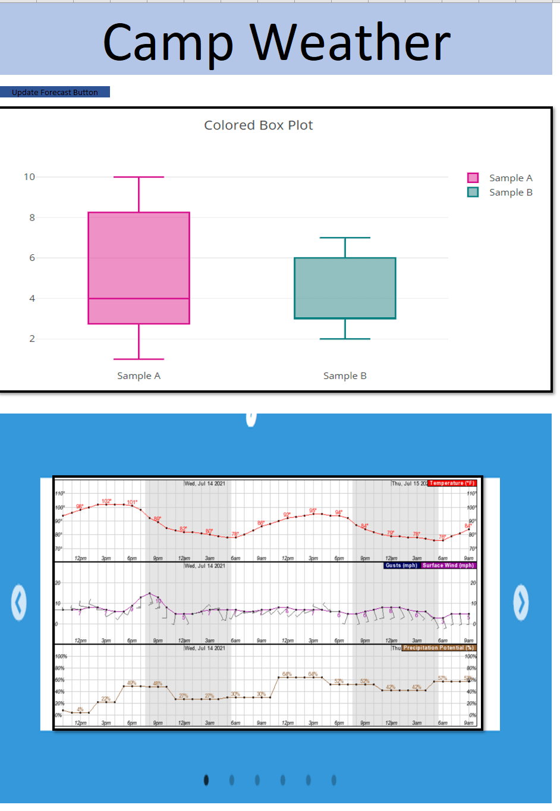

# camp_wx_dashboard

### Description
Build a dashboard for a Tucson AZ camping club that gathers the National Weather Service forecast for their favorite campsites. Club members can quickly check which campground to head to for the weekend.

### Data Sources
* National Weather Service API: <a href="https://www.weather.gov/documentation/services-web-api" target="_blank">https://www.weather.gov/documentation/services-web-api</a>
* National Weather Service API usage: <a href="https://weather-gov.github.io/api/" target="_blank">https://weather-gov.github.io/api/</a>
* Find Latitude/Longitude for Addresses: <a href="https://www.latlong.net/convert-address-to-lat-long.html" target="_blank">https://www.latlong.net/convert-address-to-lat-long.html</a>
* Whitetail Campground (11200 N., Whitetail Rd, Mt Lemmon, AZ 85619): 
    * **Point metadata:** <a href="https://api.weather.gov/points/32.4128,-110.7313" target="_blank">https://api.weather.gov/points/32.4128,-110.7313</a>
    * **Forecast grid data (detailed data organized by arrays of measurements rather than time objects):** <a href="https://api.weather.gov/gridpoints/TWC/100,55" target="_blank">https://api.weather.gov/gridpoints/TWC/100,55</a>
    * **Historical Weather Table (Current weather is first row of the table):** <a href="https://www.wrh.noaa.gov/mesowest/getobext.php?sid=QSLA3&wfo=twc&num=72" target="_blank">https://www.wrh.noaa.gov/mesowest/getobext.php?sid=QSLA3&wfo=twc&num=72</a>
    * **Site Details:** <a href="https://www.fs.usda.gov/recarea/coronado/recreation/camping-cabins/recarea/?recid=25720&actid=33" target="_blank">https://www.fs.usda.gov/recarea/coronado/recreation/camping-cabins/recarea/?recid=25720&actid=33</a>
    * **Reservation Link:** <a href="https://www.recreation.gov/camping/campgrounds/234564" target="_blank">https://www.recreation.gov/camping/campgrounds/234564</a> 
    * **Campground Map Image Link:** 
    * **Campsite Image Link:** <a href="https://cdn.recreation.gov/public/images/73481.jpg" target="_blank">https://cdn.recreation.gov/public/images/73481.jpg</a>
    * **Embedded Google Image Link:**
    
        <iframe src="https://www.google.com/maps/embed?pb=!1m18!1m12!1m3!1d1693051.1255537884!2d-112.83582618040668!3d34.024871918489275!2m3!1f0!2f0!3f0!3m2!1i1024!2i768!4f13.1!3m3!1m2!1s0x86d6154115d284d9%3A0x7aa7315561d34ec!2sWhitetail%20Campground!5e0!3m2!1sen!2sus!4v1626553239228!5m2!1sen!2sus" width="600" height="450" style="border:0;" allowfullscreen="" loading="lazy">
        </iframe>

    
* Madera Canyon (S Madera Canyon Rd, Amado, AZ 85645): 
    * **Point metadata:** <a href="https://api.weather.gov/points/31.7408,-110.8858" target="_blank">https://api.weather.gov/points/31.7408,-110.8858</a>
    * **Forecast grid data (detailed data organized by arrays of measurements rather than time objects):** <a href="https://api.weather.gov/gridpoints/TWC/91,27" target="_blank">https://api.weather.gov/gridpoints/TWC/91,27</a>
* Show Low Lake Campground (5800 Show Low Lake Rd, Lakeside, AZ 85929): 
    * **Point metadata:** <a href="https://api.weather.gov/points/34.1953,-110.0067" target="_blank">https://api.weather.gov/points/34.1953,-110.0067</a>
    * **Forecast grid data (detailed data organized by arrays of measurements rather than time objects):** <a href="https://api.weather.gov/gridpoints/FGZ/127,37" target="_blank">https://api.weather.gov/gridpoints/FGZ/127,37</a>
* Crescent Moon Ranch (300 Red Rock Crossing Rd, Sedona, AZ 86336): 
    * **Point metadata:** <a href="https://api.weather.gov/points/34.8278,-111.8096" target="_blank">https://api.weather.gov/points/34.8278,-111.8096</a>
    * **Forecast grid data (detailed data organized by arrays of measurements rather than time objects):** <a href="https://api.weather.gov/gridpoints/FGZ/65,72" target="_blank">https://api.weather.gov/gridpoints/FGZ/65,72</a>
* Indian Garden Campground (Bright Angel Trail, Grand Canyon Village, AZ 86023): 
    * **Point metadata:** <a href="https://api.weather.gov/points/36.0798,-112.1255" target="_blank">https://api.weather.gov/points/36.0798,-112.1255</a>
    * **Forecast grid data (detailed data organized by arrays of measurements rather than time objects):** <a href="https://api.weather.gov/gridpoints/FGZ/61,129" target="_blank">https://api.weather.gov/gridpoints/FGZ/61,129</a>

### Technologies
* Underlying Components
    * Python Flask (similar to Mars webscraping challenge)
    * postgreSQL database (similar to Mars webscraping challenge, replace json data every update)
    
| Index | Campground Name | Metadata URL | Grid Data URL | Point Metadata JSON | Forecast Grid Data JSON |
|----------------|---------------|----------------|---------------|----------------|---------------|
| 0 | Whitetail | url_point_metadata | url_forecast_griddata | d3.json(url_point_metadata, function(data) {return metadata}); | d3.json(url_forecast_griddata, function(data) {return griddata}); |

* Visible Dashboard
    * Button to update database (similar to Mars webscraping)
    * Plotly box plot of all forecasted temperatures for each campground (<a href="https://plotly.com/javascript/box-plots/" target="_blank">https://plotly.com/javascript/box-plots/</a>)
    * single item slick carousel of Campground detailed forecasts as Plotly stacked line charts of Temp, Winds, & Precip similar to NWS hourly graph (<a href="https://kenwheeler.github.io/slick/" target="_blank">https://kenwheeler.github.io/slick/</a>)
    
### Sample Layout

