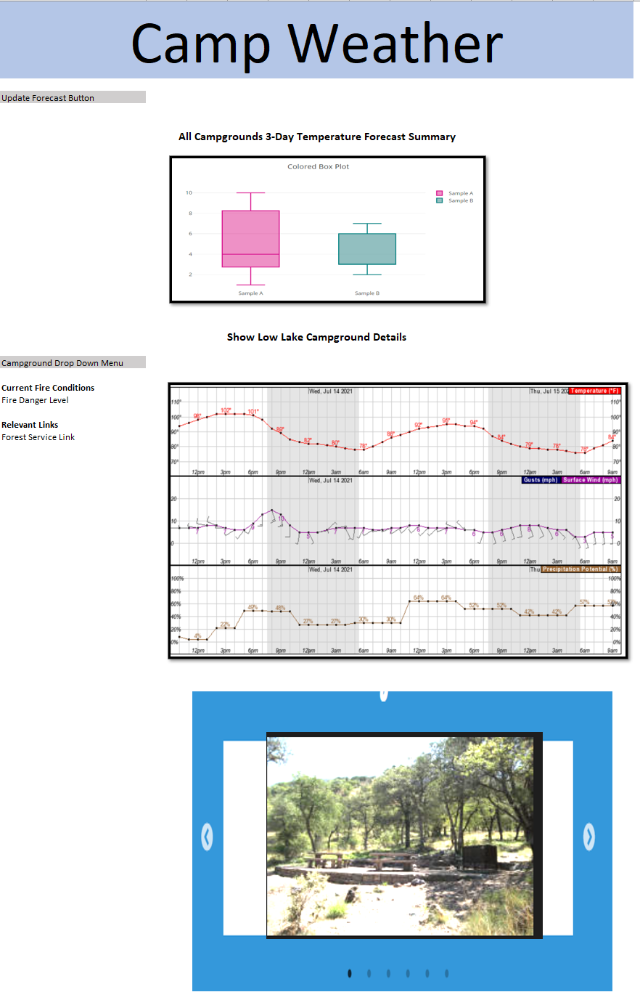

# camp_wx_dashboard

### Description
Build a dashboard for a Tucson AZ camping club that gathers the National Weather Service forecast for their favorite campsites. Club members can quickly check which campground to head to for the weekend.

### Data Sources
* National Weather Service API: <a href="https://www.weather.gov/documentation/services-web-api" target="_blank">https://www.weather.gov/documentation/services-web-api</a>
* National Weather Service API usage: <a href="https://weather-gov.github.io/api/" target="_blank">https://weather-gov.github.io/api/</a>
* Campground Weather

| Campground | Lat/Lng | Elevation | NWS Point Metadata URL | NWS Forecast Grid URL |
|----------------|-------------------|-----------|--------------------------------------------------|-----------------------------------------------|
| Bog Springs    | 31.7276,-110.8754 | 5200 ft   | https://api.weather.gov/points/31.7276,-110.8754 | https://api.weather.gov/gridpoints/TWC/91,26  |
| Rose Canyon    | 32.3950,-110.6911 | 7000 ft   | https://api.weather.gov/points/32.395,-110.6911  | https://api.weather.gov/gridpoints/TWC/101,54 |
| Spencer Canyon | 32.4186,-110.7383 | 8000 ft   | https://api.weather.gov/points/32.4186,-110.7383 | https://api.weather.gov/gridpoints/TWC/100,56 |

* Campground Details

| Campground | Forest Service URL | Campsite Image URL |
|----------------|-------------------|-----------|
| Bog Springs    | https://www.fs.usda.gov/recarea/coronado/recreation/camping-cabins/recarea/?recid=25732&actid=29 | https://www.fs.usda.gov/Internet/FSE_MEDIA/fseprd746637.jpg |
| Rose Canyon    | https://www.fs.usda.gov/recarea/coronado/recreation/camping-cabins/recarea/?recid=25698&actid=29 | https://cdn.recreation.gov/public/2019/06/20/00/19/232284_beeddff5-c966-49e2-93a8-c63c1cf21294_700.jpg |
| Spencer Canyon | https://www.fs.usda.gov/recarea/coronado/recreation/camping-cabins/recarea/?recid=25710&actid=29 | https://www.fs.usda.gov/Internet/FSE_MEDIA/fseprd746608.jpg |

### Technologies
* Underlying Components
    * Python Flask (similar to Mars webscraping challenge)
    * postgreSQL database (similar to Mars webscraping challenge, replace json data every update)
        * campground
        * lat_lng
        * elevation
        * nws_point_metadata_url
        * nws_point_metadata_json
        * nws_grid_forecast_url
        * nws_grid_forecast_json
        * forest_service_url
        * fire_danger
        * campsite_image_url
        * embedded_google_map_code
* Visible Dashboard
    * Button to update database (similar to Mars webscraping)
    * Plotly box plot of all forecasted temperatures for each campground (<a href="https://plotly.com/javascript/box-plots/" target="_blank">https://plotly.com/javascript/box-plots/</a>)
    * Campground selection drop down (similar to belly button dashboard)
    * Webscraped fire danger level (similar to Mars webscraping)
    * Links to campground webpages
    * 3-day detailed weather forecast as Plotly stacked line charts of Temp, Winds, & Precip similar to NWS hourly graph
    * Single item slick carousel of Campground image and google map location (<a href="https://kenwheeler.github.io/slick/" target="_blank">https://kenwheeler.github.io/slick/</a>)
    
### Sample Layout

